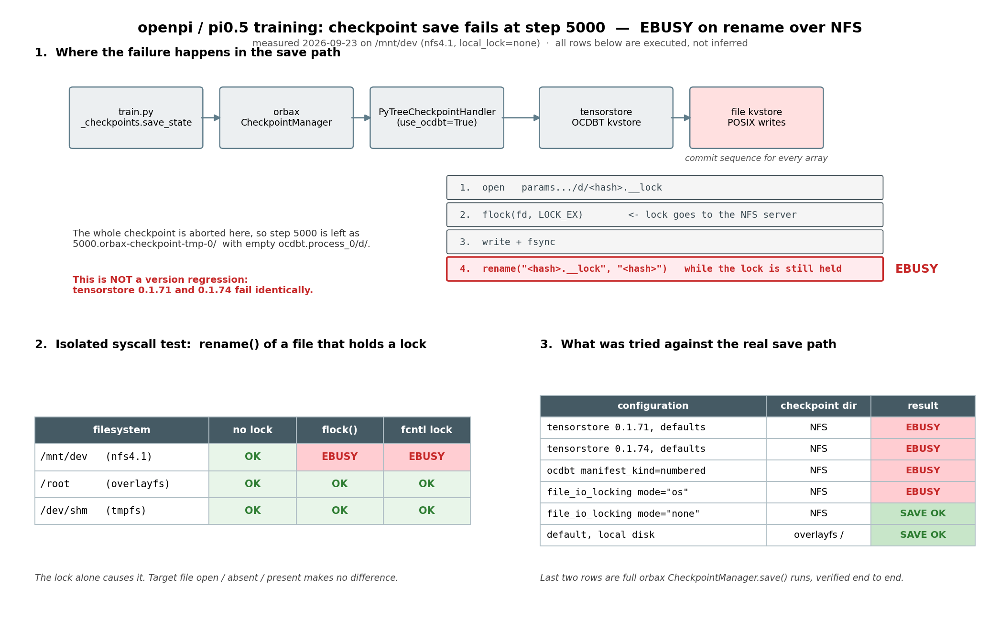
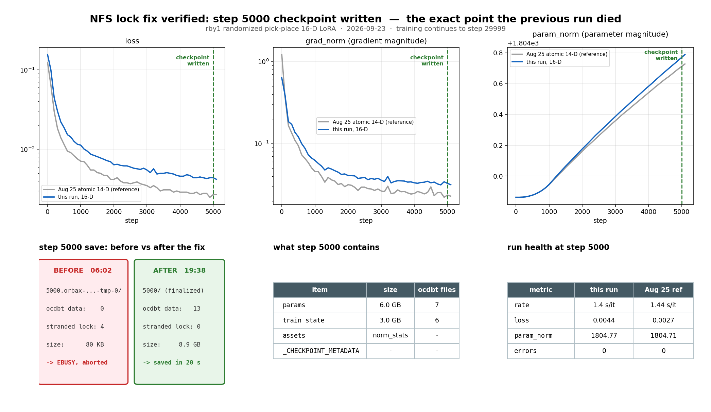

# openpi checkpoint 저장 실패 — NFS 에서 EBUSY (2026-09-23)



## 증상

`pi05_rby1_randomized_pick_place_16d_lora` 학습이 **step 5000 의 첫 checkpoint 저장에서** 죽었다.
(`logs/rby1_16d_train_30k_xla_retry_20260923.log`, `logs/rby1_16d_train_30k_workspace_ckpt_20260923.log`)

```
ValueError: FAILED_PRECONDITION: Error opening "zarr" driver: ...
Failed to rename ".../ocdbt.process_0/d/033bd...a.__lock"
              to ".../ocdbt.process_0/d/033bd...a"
[OS error 16: EBUSY Device or resource busy]
```

`--checkpoint-base-dir` 을 `openpi/checkpoints` 로 두든 `pi05_TO_hybrid/checkpoints` 로 두든 같았다.
둘 다 `/mnt/dev` 밑이다.

## 원인

`/mnt/dev` 는 `nfs4.1, local_lock=none` 으로 마운트돼 있다 — file lock 이 client 로컬이 아니라
**NFS 서버로 나간다.**

orbax 는 parameter 를 tensorstore 의 **OCDBT** key-value store 로 쓴다. tensorstore 의 file kvstore 는
array 하나를 commit 할 때마다

1. `<name>.__lock` 을 열고
2. 거기에 **lock 을 걸고** (`flock` 또는 `fcntl`)
3. 내용을 쓰고 `fsync` 한 뒤
4. **lock 을 쥔 채로** `<name>` 으로 `rename()`

한다. 이 NFS 서버는 4번을 `EBUSY` 로 거부한다.

syscall 단위로 떼어내 측정한 결과:

| filesystem | lock 없음 | `flock()` | `fcntl` lock |
|---|---|---|---|
| `/mnt/dev` (nfs4.1) | OK | **EBUSY** | **EBUSY** |
| `/root` (overlayfs) | OK | OK | OK |
| `/dev/shm` (tmpfs) | OK | OK | OK |

lock 만 쥐면 실패한다. 대상 파일이 열려 있는지, 이미 존재하는지는 무관하다.

## "이전에는 됐는데" — version regression 이 아니다

venv 가 2026-09-12 에 재설치되면서 `tensorstore 0.1.74` / `orbax 0.11.13` 이 됐길래 의심했으나,
8월 성공 당시 계열인 `tensorstore 0.1.71` 을 따로 설치해 같은 경로에 돌려도 **동일하게 EBUSY** 다.

실제 save 경로로 시도한 조합:

| configuration | checkpoint dir | 결과 |
|---|---|---|
| tensorstore 0.1.71, 기본값 | NFS | EBUSY |
| tensorstore 0.1.74, 기본값 | NFS | EBUSY |
| ocdbt `manifest_kind=numbered` | NFS | EBUSY |
| `file_io_locking mode="os"` | NFS | EBUSY |
| **`file_io_locking mode="none"`** | NFS | **SAVE OK** |
| 기본값, local disk | overlayfs `/` | SAVE OK |

Python 스택은 변수가 아니다. 바뀐 것은 **NFS mount/서버 쪽**이다. 8월 25일 run 은 같은 경로에
6 step 을 정상 저장했다. 다만 예전 mount option 기록이 없어 "옵션이 이렇게 바뀌었다" 까지는
단정할 수 없다.

## 적용한 수정

`src/openpi/training/checkpoints.py` 에 `disable_tensorstore_file_locking()` 을 추가하고
`initialize_checkpoint_dir()` 첫 줄에서 부른다. orbax 의 `get_ts_context()` 가 deep-copy 해서 쓰는
context dict 에 `file_io_locking: {"mode": "none"}` 을 넣는 방식이라 모든 call site 에 적용된다.

학습은 checkpoint 디렉터리당 writer 가 하나이므로 lock 을 꺼도 안전하다.
되돌리려면 `OPENPI_TS_FILE_LOCKING=1` 을 환경변수로 준다.

### 검증

- `initialize_checkpoint_dir()` → `CheckpointManager.save(5000, ...)` 을 NFS 경로에 실행:
  **SAVE OK**, `ocdbt.process_0/d/` 에 실제 array 파일 4개 생성.
- 같은 스크립트를 `OPENPI_TS_FILE_LOCKING=1` 로 실행: **EBUSY 재현**. 패치가 원인을 막는 것이 맞다.
- `ruff check` / `ruff format --check` 통과.

## 제거한 잔해

array 데이터가 0 바이트여서 재사용이 불가능했다 (`_CHECKPOINT_METADATA`, `norm_stats.json`,
고아가 된 `.__lock` 파일뿐).

- `openpi/checkpoints/` 전체 — `..._30k_20260923` (빈 디렉터리) 와 `..._xla_retry_20260923` (80K 잔해)
- `checkpoints/pi05_rby1_randomized_pick_place_16d_lora/` 전체 — 실패한 `5000.orbax-checkpoint-tmp-0`
- `checkpoints/pi05_rby1_lora/rby1_transport_14d_30k_20260812/` — 8월 실패 run 의 빈 디렉터리

**보존한 것** (각 54G, 6 step 완비): `pi05_rby1_atomic_lora/rby1_atomic_basket_14d_v2_30k_20260825`,
`pi05_rby1_lora/full_run_30k`, `pi05_rby1_lora/rby1_transport_14d_30k_xla_retry_20260813`.

## 실제 학습으로 최종 검증 (2026-09-23 19:38)



tmux session `rby1_16d_train` 으로 전체 학습을 돌렸다.
log: `logs/rby1_16d_train_30k_nfslockfix_20260923.log`,
launcher: `logs/launch_rby1_16d_training_nfslockfix_20260923.sh`.

**step 5000 checkpoint 가 완성됐다** — 지난 run 이 정확히 거기서 죽었던 지점이다.

| | 수정 전 (06:02) | 수정 후 (19:38) |
|---|---|---|
| 디렉터리 | `5000.orbax-checkpoint-tmp-0/` | `5000/` (finalized) |
| ocdbt data file | 0 | **13** (params 7, train_state 6) |
| 고아 `.__lock` | 4 | **0** |
| 크기 | 80 KB | **8.9 GB** (params 6.0 GB, train_state 3.0 GB) |
| 결과 | EBUSY, run abort | **20초 만에 저장 완료** |

남은 `*orbax-checkpoint-tmp*` 디렉터리 0개, `Traceback`/`EBUSY`/`FAILED_PRECONDITION` 0건.

step 5000 시점 학습 상태 (8월 atomic run 과 비교):

| metric | this run (16-D) | Aug 25 ref (14-D) |
|---|---|---|
| rate | 1.4 s/it | 1.44 s/it |
| loss | 0.0044 | 0.0027 |
| grad_norm | 0.0328 | 0.0236 |
| param_norm | 1804.77 | 1804.71 |

`loss` 가 참조보다 높은 것은 과제가 다르기 때문이다 (randomized pick-place 는 물체 위치가 매번
바뀌고, atomic basket 은 고정 배치). 곡선 모양과 `param_norm` 궤적이 겹치는 것이 중요하다 —
같은 `pi05_base` 에서 같은 LoRA schedule 로 올라가고 있다는 뜻이다.

초기에 표시되던 2.1 s/it 는 JIT 컴파일이 섞인 값이었고, 안정화 후 1.4 s/it 로 8월과 같다.
학습은 step 29999 까지 계속 진행 중이며 `5000 · 10000 · 15000 · 20000 · 25000 · 29999` 여섯 개가
보존된다 (`keep_period=5000`).

## 재실행

잔해를 지웠으므로 `--overwrite` 없이 그대로 돌리면 된다.

```bash
cd /mnt/dev/work/pi05_TO_hybrid/openpi
.venv/bin/python scripts/train.py \
  pi05_rby1_randomized_pick_place_16d_lora \
  --exp-name rby1_randomized_pick_place_16d_30k_xla_retry_20260923 \
  --checkpoint-base-dir /mnt/dev/work/pi05_TO_hybrid/checkpoints \
  --num-workers 8 \
  --no-wandb-enabled
```

`keep_period=5000`, `num_train_steps=30000` 이므로 step 5000 에서 첫 저장이 일어난다 —
거기까지 넘어가면 수정이 먹은 것이다.
