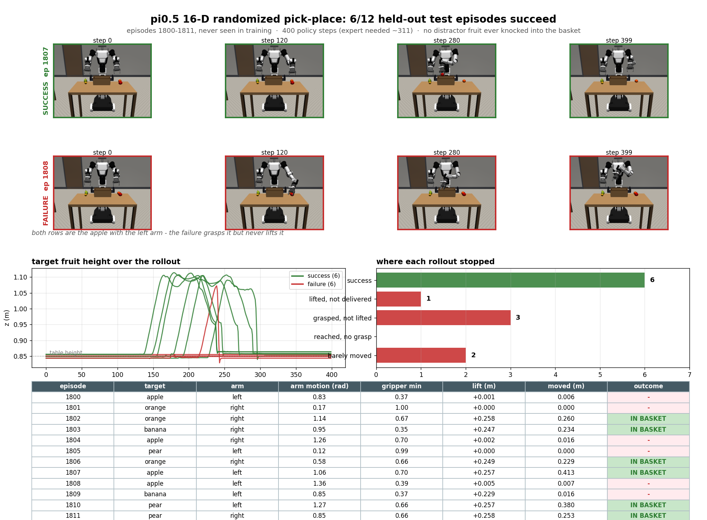
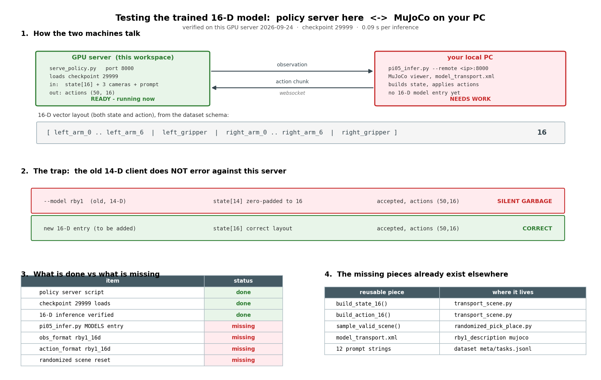

# 16-D randomized pick-place 모델 평가 환경 (2026-09-24)

학습 완료: `pi05_rby1_randomized_pick_place_16d_lora`, checkpoint 6개
(`5000`…`29999`), 최종 loss 0.0015, 에러 0건.
학습 경위는 [OPENPI_CHECKPOINT_EBUSY_NFS_KO.md](OPENPI_CHECKPOINT_EBUSY_NFS_KO.md).




## 구성

GPU server 가 policy 를 serve 하고, 로컬 PC 가 MuJoCo 를 띄워 websocket 으로 붙는다.

```
로컬 PC (MuJoCo)  --observation-->  GPU server (policy)
                  <--action chunk--
```

- **server**: [logs/serve_rby1_16d.sh](../logs/serve_rby1_16d.sh), port 8000. 컨테이너에 ssh 로 붙어
  그대로 foreground 로 돌린다 — checkpoint 로딩에 약 40초.
  `XLA_FLAGS="--xla_gpu_enable_command_buffer="` 는 **필수**다. 없이 띄우면 요청 하나에
  `CUDA graph kernel node params` 에러가 나고 그 뒤로 서버가 영구히 죽는다.
- **tunnel** (로컬 PC 에서):
  `ssh -J blunex@ai.amrc.kr:21151 root@172.21.121.112 -p 30275 -L 8000:localhost:8000 -N`
- **client**: `pi05_infer.py --model rby1_randomized_pick_place_16d --remote localhost:8000
  --episode-index 1800`

## `pi05_infer.py` 에 추가한 것

| 추가 | 내용 |
|---|---|
| `MODELS["rby1_randomized_pick_place_16d"]` | config · checkpoint · `model_transport.xml` |
| `obs_format="rby1_16d"` | state 16-D. `arm_6` 을 포함한다 — 14-D model 들은 버린다 |
| `action_format="rby1_16d"` | 7 joint 절대 목표값 적용. `arm_6` 고정 없음 |
| `load_randomized_episode()` · `reset_randomized_scene()` | 기록된 장면을 그대로 복원 |
| `randomized_split_of()` | train episode 를 고르면 경고 |
| `--episode-index` (기본 1800) | held-out 장면 선택. prompt 도 그 episode 것을 쓴다 |

16-D 배열: `[left_arm_0..6, left_gripper, right_arm_0..6, right_gripper]`.

**함정**: 기존 `--model rby1` (14-D) 로 이 서버에 붙으면 **에러가 나지 않는다.** state 가
zero-padding 되어 통과하고 `(50,16)` action 이 돌아온다 — 조용히 엉터리로 움직인다.
그래서 `apply_action` 의 `rby1_16d` 분기는 16-D 가 아니면 명시적으로 raise 한다.

## 평가 설계

dataset 2000 episode 중 **0–1599 만 학습**했다 (config `episodes=tuple(range(1600))`).
1600–1799 validation, 1800–1999 test 는 모델이 본 적 없다.

성공 판정은 데이터 수집 때 쓴 `object_in_crate()` 를 그대로 쓴다 — 임의 기준을 만들지 않는다.

## 검증

**장면 복원이 기록과 일치한다** (episode 1800): state 16-D 최대 오차 0.008 rad,
과일·바구니 위치 최대 5 mm, 카메라 3장 정상 (`zed_left` / `wrist_cam_l` / `wrist_cam_r`).

**held-out test 12 episode (1800–1811), 각 400 policy step** (expert 는 ~311 step):

| 단계 | episode 수 |
|---|---|
| **success (바구니 안)** | **6 / 12** |
| lifted, not delivered | 1 |
| grasped, not lifted | 3 |
| barely moved | 2 |

- 방해 과일을 바구니에 잘못 넣은 경우 **0건**.
- 모든 궤적이 400 step 전에 정지했다 — budget 부족이 아니다.
- 성공 시 과일을 0.85 m 에서 약 1.10 m 까지 들어 올려 0.23–0.41 m 옮긴다.
- 지시된 팔(expert 의 `used_arm`)을 고른다. 성공 사례에서 반대 팔 움직임은 0.02–0.08 rad.

**같은 episode 가 실행마다 성공/실패가 갈린다** (1800 은 단독 실행에서 성공, batch 에서 실패).
pi0.5 는 flow-matching policy 라 추론이 확률적이다. 12 episode 는 표본이 작으므로
50% 는 대략의 값으로 읽어야 한다.

## 되돌아올 지점

- 성공률을 제대로 재려면 episode 수를 늘리고 episode 당 여러 번 굴려야 한다.
- 실패의 절반(3/12)이 "쥐었으나 들지 못함" 이다 — grasp 후 lift 구간을 먼저 볼 만하다.
- checkpoint 25000 / 20000 과 비교해 보지 않았다.
